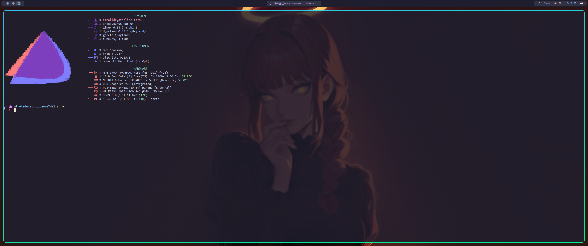
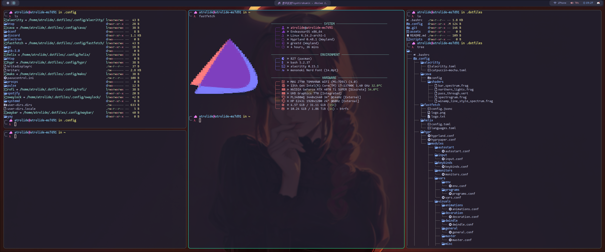
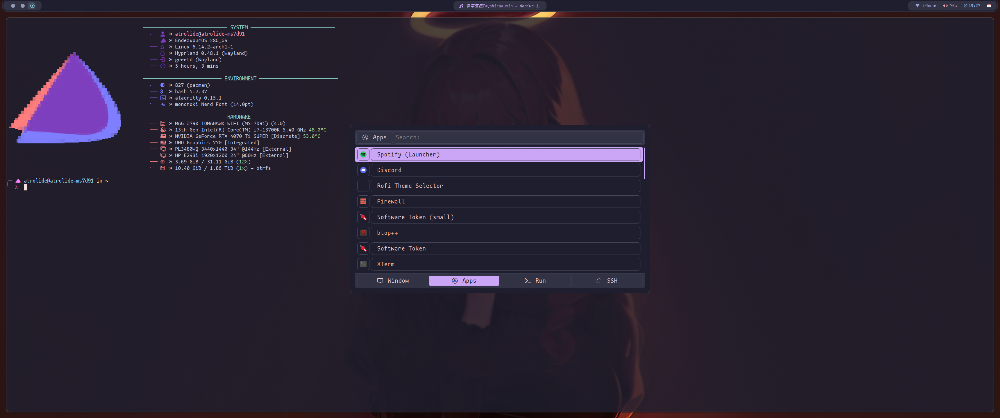
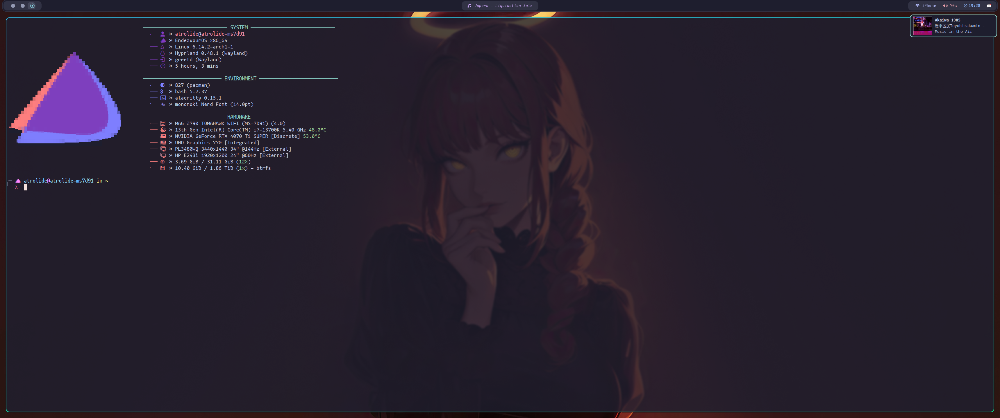
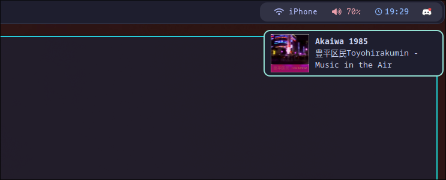
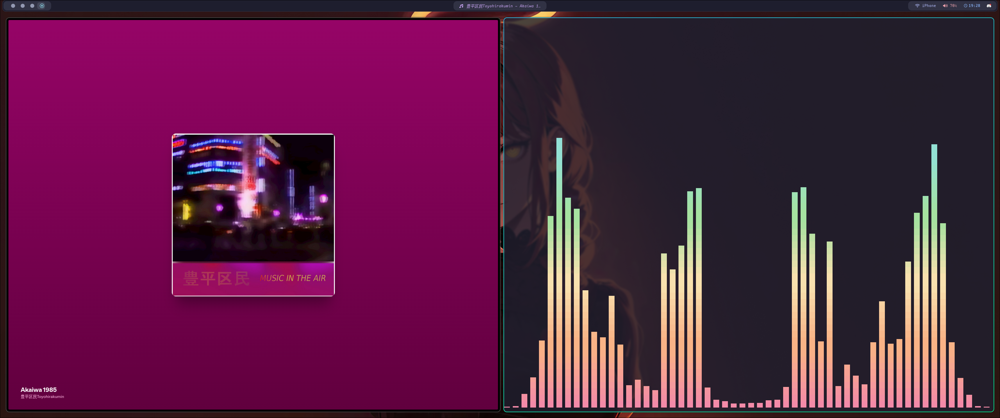

#  EndeavourOS Dotfiles

Personal configuration for EndeavourOS (Arch Linux) with Hyprland Wayland compositor.

## Screenshots
### _Alacritty_ • _Fastfetch_

### _Waybar_

### _Rofi_

### _Mako_

### _Cava_

