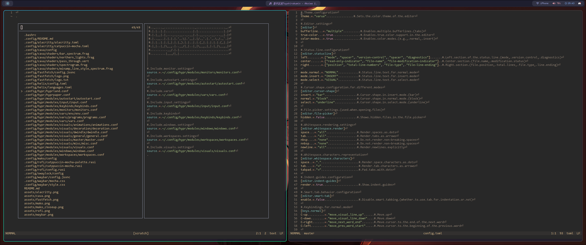

#  EndeavourOS Dotfiles

Personal configuration for EndeavourOS (Arch Linux) with Hyprland Wayland compositor.

## Screenshots & Videos
### _Alacritty_ • _Fastfetch_

### _Waybar_

### _Rofi_

### _Mako_

### _Cava_
https://github.com/user-attachments/assets/0b57b6cd-0696-4a2b-a762-7b8bff5cc34d

### _Helix_

### _Swaylock_
https://github.com/user-attachments/assets/00db8fe5-67b2-4fdb-8dbc-174d322d57e5
